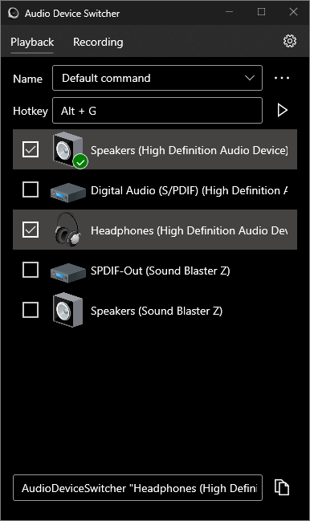

# Audio Device Switcher 

 

Audio Device Switcher is a Windows 10 app that makes it easy to quickly switch your default playback device as well as your recording device using hotkeys.

## Usage

### Active mode (application must stay open all the time)

1. Select one or more devices
2. Set up a hotkey
3. Go to settings and make sure "Run at startup & Run in the background" are enabled

When you press the hotkey, the app will cycle through the selected devices.

Clicking in the three dots menu will allow you to manage your commands (create, rename, delete).

### Offline mode (application can be closed)

1. Select one or more devices
2. Copy the generated command at the bottom
3. Open your favorite software that allows you to bind keys to commands such as a modern keyboard gaming software and paste it there
4. Go to settings and disable "Run at startup & Run in the background"

## License

This repository is licensed with the Apache, Version 2.0 license.